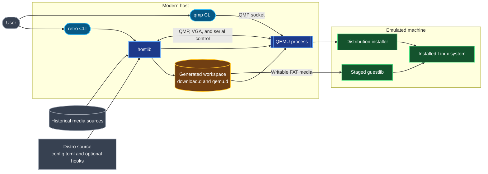
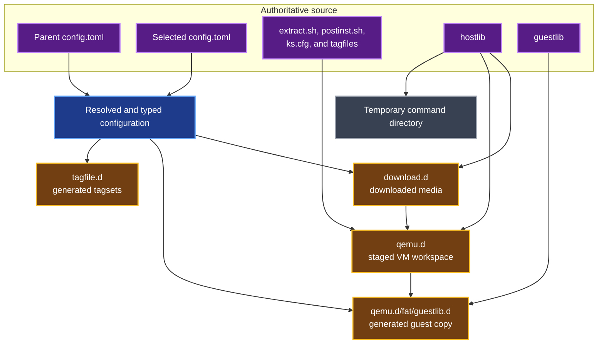
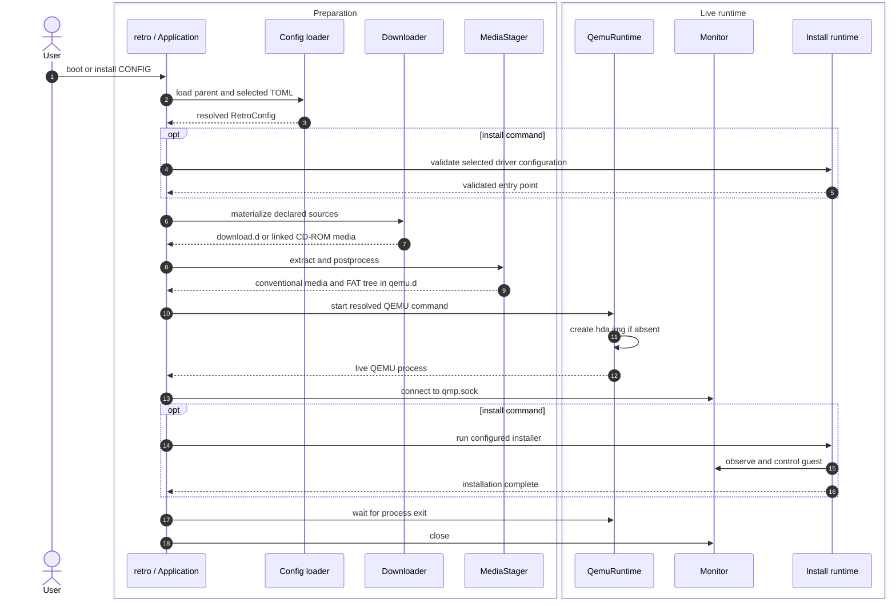
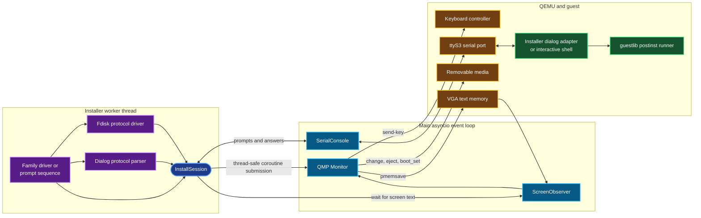

# Architecture

> Disclaimer: AI generated and not fully reviewed.

Retro Distro Playground is a configuration-driven host application that turns
historical distribution media into a runnable QEMU workspace. Most behavior is
declared in a distro's `config.toml`; Python code on the host downloads and
stages media, manages QEMU, and drives supported installers; portable shell code
in `guestlib/` performs configuration inside the installed guest.

This document describes the runtime boundaries and data flow. For configuration
fields and the workflow for adding a distro, see [CONTRIBUTING.md](CONTRIBUTING.md).
For the constraints on code that runs inside old guests, see
[guestlib/README.md](guestlib/README.md).

## System Context

There are three primary layers:

| Layer | Source | Responsibility |
| --- | --- | --- |
| Distro definition | Distro `config.toml`, tagfiles, `ks.cfg`, and exceptional hooks | Describe source media, extraction, emulated hardware, installation, and post-installation behavior. |
| Host runtime | `hostlib/`, exposed by `retro` and `qmp` | Validate configuration, download and stage media, start QEMU, and automate installers. |
| Guest runtime | `guestlib/` and an optional distro `postinst.sh` | Adapt old installers and configure the installed system with portable shell code. |

QEMU is an execution boundary rather than a fourth source layer. It consumes
the staged workspace and exposes control endpoints back to the host.

## Host Requirements

The host runtime requires Python 3.11 or newer. Pydantic validates distro
configuration, `qemu.qmp` provides QMP transport, `pycdlib` reads ISO images,
and `py7zr` handles 7-Zip archives. QEMU, `wget`, `mtools`, and a small number
of exceptional media-conversion tools are external programs installed by
`retro-prereq` and invoked by the host runtime or config hooks.

## Repository and State Model

Source and generated state deliberately live together beneath a selected distro
directory, but have different ownership rules.

The source of truth is `config.toml`, `hostlib/`, `guestlib/`, and any explicitly
configured source hook. Do not edit the staged guest-library copy under
`qemu.d/fat/guestlib.d/`; every extraction refreshes it from `guestlib/`.
`qemu.d/`, `download.d/`, and `tagfile.d/` are generated state.

`Context` resolves the selected config directory, repository root, command, and
per-command temporary directory. File lookup checks the selected directory and
then its immediate parent. Configuration loading follows the same two-level
rule: the child replaces inherited scalars and arrays, while nested tables are
merged recursively. Pydantic models validate each logical section when its
owning subsystem consumes it; installer configuration is selected through a
driver-discriminated model and unknown fields are rejected. QEMU profiles supply
era-appropriate defaults before explicit overrides are used.

Schema implementation is grouped by concern: `schema_base.py` owns strict model
defaults and user-facing validation errors, `qemu_schemas.py` owns emulator
configuration, and `media_schemas.py` owns download, extraction, network, and
post-install models. `schemas.py` contains installer models and re-exports the
other schema names as the stable import surface.

## Command Orchestration

`hostlib.cli.Application` is the composition root. Downloading, extraction,
tagfile generation, reset, and packaging are synchronous. An asyncio event loop
exists only for a live QEMU process and its monitor and installer transports.

Command dependencies are centralized rather than repeated by callers:

| Command | Behavior |
| --- | --- |
| `download` | Materializes declared direct files, mirrors, and shared CD-ROM media. |
| `extract` | Downloads, stages media into `qemu.d/`, and refreshes guestlib. |
| `boot` | Downloads, stages, creates a disk if needed, and starts QEMU. |
| `install` | Validates installer settings before startup, then follows the boot path and runs automation. |
| `tagfile` | Downloads and stages before generating Slackware package selections. |
| `package` | Downloads and stages, creates the disk and launchers, then archives a dereferenced `qemu.d/`. |
| `reset` | Removes generated `qemu.d/` state after confirmation. |

Downloader operations are idempotent for files that already exist. Extraction
uses `qemu.d/.extracted` as its completion marker; even on a marker hit, the
guest library and generated post-install configuration are refreshed.

## Media Staging Contract

`MediaStager` is the boundary between heterogeneous source media and QEMU. It
can select files and package trees from directories, ISO images, tar archives,
ZIP archives, and 7-Zip archives. Declarative postprocessing handles
decompression, floppy truncation, overlays, and conventional links. A custom
`extract.sh` is reserved for conversions that cannot be expressed by this path.

QEMU does not need to understand the original archive layout. `QemuRuntime`
discovers a small set of conventional names in `qemu.d/`:

| Staged path | Meaning |
| --- | --- |
| `boot.img` / `root.img` | Default install floppy and optional root floppy. |
| `install.iso` | Default install CD-ROM. |
| `fda.img` through `fdb.img` | Explicit floppy attachments. |
| `hda.img` through `hdd.img` | Explicit IDE disk attachments; `hda.img` is the default target disk. |
| `hdc.iso` and similar | Explicit IDE CD-ROM attachments. |
| `fat/` | Writable FAT-backed exchange disk, conventionally attached as the second IDE disk. |
| `qmp.sock` | QEMU Machine Protocol control socket. |
| `ttyS0.sock`, `ttyS1.sock`, `ttyS3.sock` | Guest serial endpoints; `ttyS3` is reserved for installer automation. |
| `lp0.sock` | Captured first parallel port. |

This filename contract decouples extraction rules from QEMU argument
construction and lets packaged workspaces start without re-reading the distro
configuration.

## Installer Automation

Reusable family drivers live in `hostlib/installers/`. The bounded
`prompt-sequence` driver handles exceptional linear flows using a validated
registry of actions. Both use the synchronous `InstallSession` API, so driver
code reads like the installer procedure it represents. Family drivers consume
the typed `disk`, `network`, `locale`, `prompts`, and family-specific sections
of the selected install model directly.

The live transports are asynchronous. `run_install` owns the serial transport
on the main event loop, instantiates the demand-driven VGA observer, and runs
the synchronous driver in a worker thread. Calls through `InstallSession` are
submitted back to the owning event loop. This keeps QMP and serial input
responsive while a driver performs blocking waits.

The automation channels have separate purposes:

- QMP sends paced keyboard input and controls removable media and the next boot
  device.
- VGA observation dumps text memory with QMP and matches screen text without
  requiring guest support.
- The `ttyS3` socket carries structured dialog exchanges or an interactive
  shell. `SerialConsole` continuously buffers and logs this stream while driver
  waits consume it independently.
- The `qmp` command-line utility reuses the monitor, keyboard encoder, and VGA
  decoder for manual inspection and recovery of a running VM.

Transport and QMP cleanup is guaranteed when automation fails. The CLI also
terminates a still-running QEMU process when it exits through an exception.

## Post-Installation Runtime

During extraction, the host copies `guestlib/` into
`qemu.d/fat/guestlib.d/` and renders `[postinst]` as shell assignments in
`distro/config.sh`. If the ordered stages include `custom`, it also stages the
configured distro `postinst.sh`.

After installation, the host-side driver logs in, mounts the FAT exchange disk
at `/retro` when necessary, and starts `/retro/guestlib.d/postinst.sh`. The
runner sources the generated configuration and executes `modules`, `network`,
`tty`, `x11`, and `custom` stages in order.

This boundary is intentionally narrow: modern Python performs parsing and
validation, while the guest receives simple quoted shell variables and portable
`sh`. Guest code must remain compatible with very old Bash and ash versions and
with installer environments that may not contain common Unix utilities.

## Network and Trust Boundaries

QEMU user-mode networking is the default. It gives the guest outbound access
behind NAT and binds generated host forwards to loopback. When forwards are not
declared, the runtime selects free host ports from the ranges beginning at 2200
for guest SSH and 2300 for guest Telnet. An explicit empty forward list disables
forwards, and disabling the configured network omits the guest NIC.

The emulated systems are obsolete and should be treated as untrusted. Keep port
forwards loopback-only, do not place sensitive data in the guest, and use the
writable FAT exchange disk as a controlled boundary. Avoid changing its host
directory while the VM is running.

## Extension Boundaries

When extending the project, prefer the narrowest existing layer:

1. Express ordinary media, hardware, install, and post-install behavior in
   `config.toml`.
2. Extend `MediaStager` and its typed extraction schema for reusable source
   formats or transformations. Use `extract.sh` only for exceptional media
   conversion.
3. Extend an installer-family driver when behavior branches or repeats across
   releases. Use `prompt-sequence` only for a distro-specific linear exchange.
4. Add reusable installed-system behavior to `guestlib/`; use a distro custom
   post-install stage only when a portable shared stage cannot express it.
5. Preserve the conventional `qemu.d` filenames and the dialog serial protocol,
   because they are contracts between independently evolving components.

Host source changes should pass `python3 -m unittest tests.test_python` and
`tests/unit.sh`. Changes under `guestlib/` also require review against the
portability constraints in [guestlib/README.md](guestlib/README.md).
