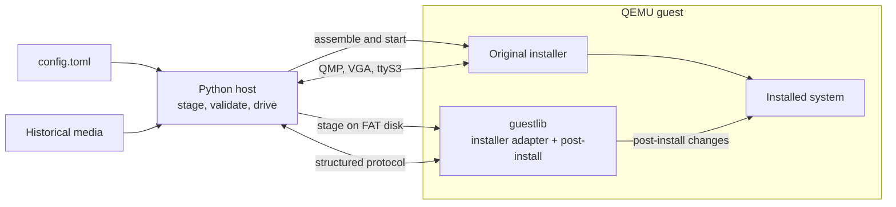
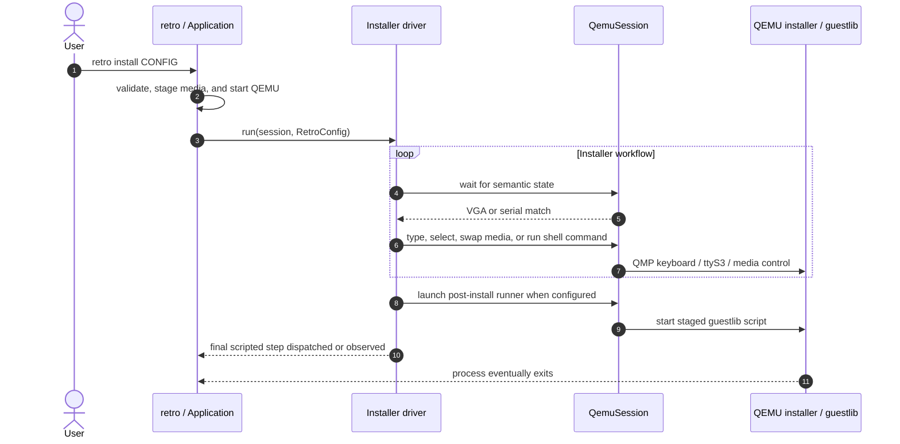
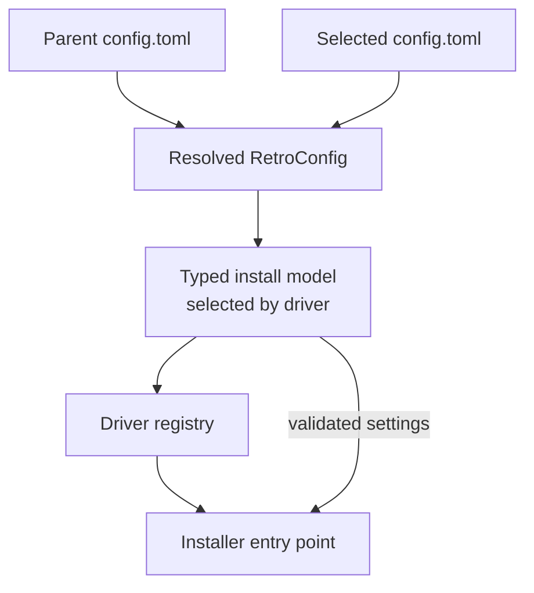
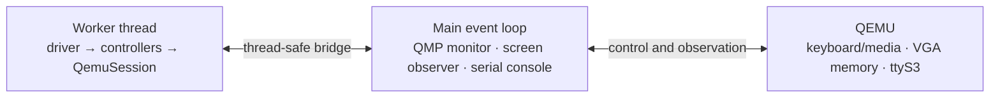
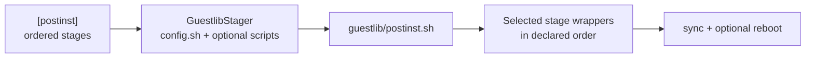
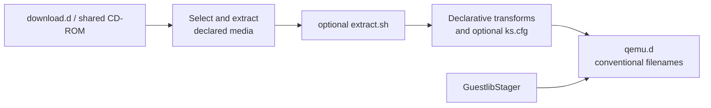
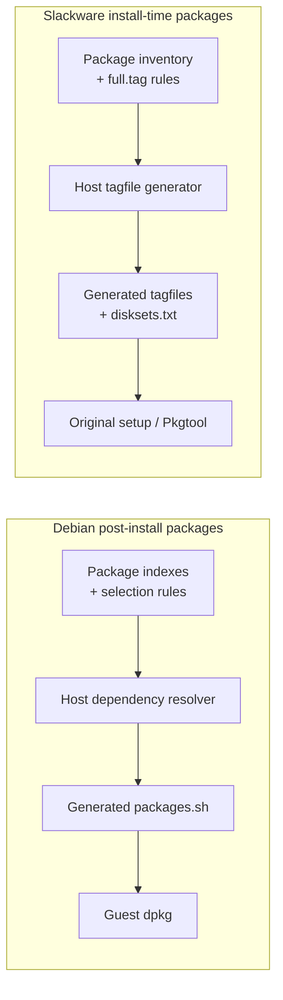

# Architecture

Retro Distro Playground is a configuration-driven installer harness for old
Linux releases. Modern Python owns orchestration and installer policy; QEMU
provides the machine and control surfaces; small portable shell programs run
only where the installer or installed guest must cooperate.

The architecture is centered on **host-side installer drivers**. The host turns
configuration and historical media into a VM, then drives the original
installer through observable screen and serial states. Small guest programs are
staged only for work that must happen inside the installer or installed system.

For configuration fields, see [CONFIG.md](CONFIG.md). For guest-code
portability rules, see [guestlib/README.md](guestlib/README.md).

## Architecture at a Glance


```mermaid
flowchart LR
    config["config.toml"] --> host["Python host<br/>stage, validate, drive"]
    media["Historical media"] --> host

    subgraph vm[QEMU guest]
        installer["Original installer"] --> system["Installed system"]
        runtime["guestlib<br/>installer adapter + post-install"] -->|post-install changes| system
    end

    host -->|assemble and start| installer
    host <-->|QMP, VGA, ttyS3| installer
    host -->|stage on FAT disk| runtime
    host <-->|structured protocol| runtime
```

The diagram separates three responsibilities: declarative release data, modern
host orchestration, and software running in the emulated machine. The host
controls the workflow, while the original installer remains responsible for
creating the target system.

| Area | Architectural weight | What belongs there |
| --- | --- | --- |
| Installer drivers | Primary | Boot sequences, installer phases, release variants, prompt answers, and branching. |
| VM control layer | Primary | Stable synchronous operations over QMP, VGA text memory, and the automation serial port. |
| Typed configuration | Primary | Release-specific data selected by `install.driver`; no screen-control logic. |
| Guest runtime | Secondary | Installer adapters and portable installed-system configuration that must run inside old guests. |
| Media and QEMU setup | Supporting | Turn heterogeneous source media into the conventional VM workspace expected by installation. |

## Installation Lifecycle

`retro install` is a host-controlled workflow. QEMU runs the original installer,
but Python decides what to observe and what action to take next.


```mermaid
sequenceDiagram
    autonumber
    actor User
    participant App as retro / Application
    participant Driver as Installer driver
    participant Session as QemuSession
    participant VM as QEMU installer / guestlib

    User->>App: retro install CONFIG
    App->>App: validate, stage media, and start QEMU
    App->>Driver: run(session, RetroConfig)
    loop Installer workflow
        Driver->>Session: wait for semantic state
        Session-->>Driver: VGA or serial match
        Driver->>Session: type, select, swap media, or run shell command
        Session->>VM: QMP keyboard / ttyS3 / media control
    end
    Driver->>Session: launch post-install runner when configured
    Session->>VM: start staged guestlib script
    Driver-->>App: final scripted step dispatched or observed
    VM-->>App: process eventually exits
```

The important lifecycle rules are:

- Install configuration is validated **before** downloads, staging, disk
  creation, or QEMU startup.
- The original installer remains the authority for disk formatting, base-system
  package installation, boot-loader setup, and similar distro behavior.
- A Python driver coordinates the installer through observable states; it does
  not use fixed-duration macros as its main control mechanism.
- Installation is one-time VM creation. Later `retro boot` runs do not invoke a
  driver.
- Completion means the driver finished its scripted workflow. Post-installation
  normally continues inside the guest; a driver waits for it only when the host
  must answer configured prompts.
- If automation fails, the traceback is logged, QMP is released, and QEMU stays
  open for inspection with the standalone `qmp` command.

## Installer Configuration and Dispatch

The resolved `[install]` table is a Pydantic discriminated union keyed by
`install.driver`.


```mermaid
flowchart TD
    parent["Parent config.toml"]
    child["Selected config.toml"]
    resolved["Resolved RetroConfig"]
    model["Typed install model<br/>selected by driver"]
    dispatch["Driver registry"]
    entry["Installer entry point"]

    parent --> resolved
    child --> resolved
    resolved --> model --> dispatch --> entry
    model -->|validated settings| entry
```

| Concern | Owner | Rule |
| --- | --- | --- |
| Inheritance | `hostlib/config.py` | The selected config overlays its immediate parent; nested tables merge, scalars and arrays replace. |
| Shared install values | `hostlib/schemas/install.py` | Common disk, locale, and prompt contracts. |
| Family values | `hostlib/schemas/{debian,redhat,slackware}.py` | Driver-specific models and allowed `variant` names. |
| Driver union | `hostlib/schemas/__init__.py` | Rejects unknown fields and chooses the complete model from `driver`. |
| Dispatch | `hostlib/install/__init__.py` | Maps the validated driver name to one Python entry point. |
| Release behavior | `hostlib/install/*.py` | Consumes typed config and implements the screen workflow. |

The split between data and policy is deliberate:

- TOML contains values that legitimately vary by recipe: media paths, package
  choices, accounts, locale, network settings, and a named installer variant.
- A Python variant profile contains fixed release-family behavior: screen
  order, labels, boot quirks, optional phases, and workflow branches.
- The driver contains control flow. Prompt sequences and keyboard navigation do
  not belong in TOML.

The default swap size is derived from the selected QEMU profile's memory unless
the install config overrides it.

## Driver Families

Reusable family drivers cover most automated recipes. Focused drivers remain
appropriate for installers that do not share a stable family workflow.

| Strategy | Registered drivers | Main abstraction |
| --- | --- | --- |
| Guest `dialog` protocol | `slackware-dialog`, `debian-dialog`, `redhat-dialog` | Replace the installer's `dialog` binary with `guestlib/dialog.sh`; match structured widgets in Python. |
| Semantic VGA/Newt control | `redhat-newt` | Parse Newt boxes, colors, fields, menus, checkboxes, radios, and buttons from VGA cells. |
| Unattended installer supervision | `redhat-unattended` | Supply a boot command, wait for completion, then optionally run post-installation. |
| Focused direct workflows | `debian-091`, `slackware-sysinstall`, `slackware-tty` | Compose VGA waits, serial shells, keyboard input, and shared helpers directly. |

Family drivers are structured around installer phases rather than a flat key
macro. Common examples include:

- boot and removable-root-media handling;
- partitioning through the shared `Fdisk` controller;
- target filesystem and package-source selection;
- package or component selection;
- locale, network, accounts, X11, and boot-loader setup;
- reboot, first boot, and post-install launch.

Unexpected states fail with context instead of silently continuing. Variant
profiles allow known release differences without duplicating whole drivers.

## VM Control Layer

Drivers receive two separate objects:

| Input | Purpose |
| --- | --- |
| `RetroConfig` | Validated distro policy and release-specific values. |
| `QemuSession` | Distro-independent synchronous control of the running VM. |

`QemuSession` is intentionally synchronous because installer workflows read
like scripts. Its QMP, VGA, and serial operations run on the event loop; in
particular, serial input continues to be buffered while a driver blocks on the
next installer state.


```mermaid
flowchart LR
    worker["Worker thread<br/>driver → controllers → QemuSession"]
    eventloop["Main event loop<br/>QMP monitor · screen observer · serial console"]
    qemu["QEMU<br/>keyboard/media · VGA memory · ttyS3"]

    worker <-->|thread-safe bridge| eventloop
    eventloop <-->|control and observation| qemu
```

`run_script` owns this boundary:

1. Start `SerialConsole` for `qemu.d/ttyS3.sock` on the main event loop.
2. Create `QemuSession` with that loop and the connected QMP monitor.
3. Run the synchronous driver in a worker thread with `asyncio.to_thread`.
4. Submit transport calls back to the owning loop with
   `run_coroutine_threadsafe`.
5. Close the automation serial transport even when the driver fails.

### Observation and Action Channels

| Channel | Direction | Used for |
| --- | --- | --- |
| QMP `send-key` | Host to guest | Paced keyboard input compatible with old keyboard controllers. |
| QMP/HMP commands | Host to QEMU | Floppy changes, next-boot selection, and VGA-memory dumps. |
| VGA text memory | Guest to host | Installer text, raw CP437 cells, coordinates, and color attributes without guest support. |
| `ttyS3` serial socket | Both | Structured dialog exchanges, interactive installer shells, `fdisk`, and post-install prompts. |
| FAT exchange disk | Both | Stage host inputs and provide controlled file exchange with the guest. |

The channels complement one another. VGA works before the guest can cooperate;
serial is precise once a shell or adapter is available; QMP remains the action
and device-control path.

### Screen Controllers

| Layer | Knows about | Does not know about |
| --- | --- | --- |
| `ScreenObserver` / `ScreenSnapshot` | VGA memory, CP437 decoding, cells, attributes, rectangular views, polling, stale-screen invalidation. | A particular installer or widget toolkit. |
| `NewtDialog` | Red Hat Newt geometry, palette, fields, lists, checkboxes, radios, and buttons. | Release phase ordering or configuration policy. |
| `Dialog` | The `TITLE`, `TYPE`, `TEXT`, `ITEM`, and `RESPONSE` wire protocol. | How the original widget is rendered. |
| Family driver | Expected screens, valid transitions, phase order, and configured answers. | Async transport mechanics. |

VGA state is invalidated after keys that normally activate a screen, preventing
the next wait from matching the prompt that was just answered. The serial
console independently tracks receipt, consumption, and transcript positions;
`Dialog` can mark and rewind a protocol exchange when a callback takes over.

## Guest-Side Cooperation

`guestlib/` serves two distinct roles. They share staging and portability
constraints, but run at different times.

| Guest component | Runs when | Responsibility |
| --- | --- | --- |
| `dialog.sh` | During supported installers | Stand-in for old `dialog(1)`; exposes widget metadata over `ttyS3` and returns the host's answer to the installer. |
| `postinst.sh`, `config/*.sh`, and generated distro scripts | After the original install | Apply reusable installed-system configuration for packages, modules, network, serial login, and X11. |

The installer adapter preserves the parts of real `dialog(1)` that installer
scripts depend on:

| Contract | Behavior |
| --- | --- |
| Control protocol | Emit ordered `TITLE`, `TYPE`, `TEXT`, `ITEM`, and `RESPONSE` fields for Python's structural matcher. |
| Result channel | Keep prompt metadata separate from the output descriptor that receives the selected tag or typed value. |
| Status compatibility | Return the conventional success, cancel/no, and escape exit statuses expected by installer scripts. |
| Serial fallback | Use `/dev/ttyS3` for duplex control when writable; otherwise remain usable from the installer's stdin and console. |
| Portability | Run as standalone old-`sh` code using shell builtins plus its existing `rm` dependency. |

During extraction, `GuestlibStager` rebuilds
`qemu.d/fat/guestlib.d/` from the source `guestlib/` tree. It also generates:

- `distro/config.sh` from `[postinst]`;
- `distro/packages.sh` for configured Debian package installation;
- `distro/postinst.sh` only for a configured custom stage;
- Slackware tagfiles where required.

The post-install runner is an ordered stage machine configured by
`postinst.stages`:


```mermaid
flowchart LR
    toml["[postinst]<br/>ordered stages"]
    render["GuestlibStager<br/>config.sh + optional scripts"]
    runner["guestlib/postinst.sh"]
    stages["Selected stage wrappers<br/>in declared order"]
    result["sync + optional reboot"]

    toml --> render --> runner --> stages --> result
```

Only configured stages run, and they run in the declared order.

| Stage | Guest input | Responsibility | Requests reboot by default |
| --- | --- | --- | --- |
| `packages` | Generated `distro/packages.sh` | Install dependency-ordered Debian packages from configured media roots. | No |
| `modules` | `config/modules.sh` | Detect Slackware or Debian module layouts and configure boot-time modules. | Yes |
| `network` | `config/net.sh` | Detect `rc.inet1`, SysV `init.d`, or `rc.net` and write static QEMU-friendly networking. | Yes |
| `tty` | `config/tty.sh` | Enable a serial getty and update old login-security files where present. | Yes |
| `x11` | `config/x11.sh` | Detect the installed XFree86 generation and write its native display configuration. | No |
| `custom` | Staged `distro/postinst.sh` | Run the exceptional distro-specific behavior named by the config. | No |

The runner sources helper files lazily, so an old guest needs only the commands
used by its selected stages. `logging.sh` writes the shared transcript to
stderr and `POSTINST_LOG`; debug messages are opt-in. The runner validates
required generated scripts, reports completion, calls `sync`, and reboots when
`POSTINST_REBOOT` is enabled by config or by a stage wrapper.

Shared configuration helpers detect the target's historical file layout, back
up native files using that subsystem's legacy convention, and skip unsupported
layouts where safe. Release-specific exceptions remain in the custom stage
rather than accumulating in these cross-distro helpers.

A driver mounts the FAT disk, installs the dialog adapter into an installer
ramdisk when its family uses that protocol, and later starts
`/retro/guestlib.d/postinst.sh` when post-install stages are configured.

The guest boundary stays narrow:

- Modern Python parses TOML, validates types, resolves packages, and renders
  simple quoted shell assignments.
- Guest scripts contain only behavior that must run against the old system's
  files and commands.
- All guest code must remain compatible with old `sh` implementations. The
  installer-facing adapter has the stricter constraint of running in minimal
  ramdisks; post-install helpers may use utilities present on the installed
  target.
- `qemu.d/fat/guestlib.d/` is generated; edit `guestlib/`, not its staged copy.

## Supporting Host Pipelines

### Host Subsystem Map

Every `hostlib` module belongs to one of these boundaries:

| Boundary | Modules | Contract |
| --- | --- | --- |
| Shared errors | `hostlib/__init__.py` | Project-owned configuration, command, and runtime failures exposed to both CLIs. |
| Context and configuration | `context.py`, `config.py` | Resolve config paths and temporary state; merge parent and child TOML; expose validated sections. |
| Typed schemas | `schemas/*.py` | Strict, non-coercing subsystem models that reject unknown settings and translate validation errors. |
| Acquisition | `download.py` | Materialize direct files, supported mirrors, and shared CD-ROM sources. |
| Media access and staging | `iso.py`, `media_extract.py`, `media.py` | Normalize source formats, select safe members, apply transformations, and produce `qemu.d`. |
| Generated guest inputs | `guestlib.py`, `debian_packages.py`, `slackware_tagfiles.py` | Render post-install config, package scripts, and installer package selections. |
| VM assembly | `qemu.py` | Build era-appropriate QEMU arguments, devices, networking, sockets, and process lifecycle. |
| VM transports | `qmp.py`, `vga.py`, `serial.py`, `session.py` | Provide QMP control, screen observation, serial buffering, and the synchronous driver facade. |
| Installer policy | `install/*.py` | Dispatch drivers and implement family workflows, widget controllers, partitioning, and post-install launch. |
| Entry points | `retro_cli.py`, `qmp_cli.py` | Compose commands, translate failures, and expose automated or manual VM control. |

Configuration is validated at the owning subsystem boundary rather than as one
monolithic startup schema:

| Config section | Primary consumer |
| --- | --- |
| `[download]` | `Downloader` |
| `[extract]` | `MediaStager` and `MediaExtractor`; `Downloader` also reads package selectors for Debian mirrors. |
| `[qemu]` | `QemuRuntime` |
| `[install]` | Installer validation and the selected driver |
| `[postinst]` | `GuestlibStager` and installer post-install helpers |

All schema models share strict typing and unknown-field rejection. A section is
validated when a command reaches a consumer for it, so unrelated sections do
not need to validate. The Debian mirror path is the intentional exception
across boundaries: acquisition reads package selectors from `[extract]` to know
which package trees to download.

### Command Orchestration

`hostlib.retro_cli.Application` is the composition root. Preparation commands
are synchronous; an asyncio event loop exists only while QEMU is live.

| Command | Dependency path |
| --- | --- |
| `download` | Materialize declared files, mirrors, or shared CD-ROM media. |
| `extract` | Download, stage media, and refresh generated guestlib. |
| `boot` | Extract, create the disk if absent, start QEMU, then release QMP for manual use. |
| `install` | Validate the driver, follow `boot`, and run installer automation. |
| `tagfile` | Extract, then generate Slackware package selections. |
| `package` | Extract, create disk and launchers, then archive a dereferenced workspace. |
| `reset` | Remove generated `qemu.d/` state after confirmation. |

### Media Staging

`MediaStager` is the boundary between heterogeneous historical media and the
small filename contract consumed by `QemuRuntime`.


```mermaid
flowchart LR
    source["download.d / shared CD-ROM"]
    extract["Select and extract<br/>declared media"]
    hook["optional extract.sh"]
    transform["Declarative transforms<br/>and optional ks.cfg"]
    stage["qemu.d<br/>conventional filenames"]
    guestlib["GuestlibStager"]

    source --> extract --> hook --> transform --> stage
    guestlib --> stage
```

Acquisition and extraction preserve repeatability and constrain untrusted media
paths:

| Input path | Behavior and safety contract |
| --- | --- |
| Direct downloads | Reject absolute and parent-traversal targets, skip existing targets, and remove the target after a failed transfer. |
| HTTP mirrors | Validate release identifiers, continue interrupted transfers, and write `.complete` only after the recursive download succeeds. |
| Shared CD-ROM configs | Download into the referenced `cdrom/` config and symlink its ISO images into the selected recipe's `qemu.d`. |
| Directories and archives | Select only declared files and package trees from directories, tar, ZIP, and 7-Zip sources; reject escaping selectors and members. |
| ISO images | Prefer Rock Ridge, then Joliet, then ISO9660; normalize case and `;version` suffixes for historical-media lookup. |
| Custom extraction | Run a configured Bash hook after source selection but before declarative postprocessing; any failure aborts staging. |

Tar extraction uses the standard data-only filter. Package destinations and
overlays are resolved beneath their declared staging roots. Kickstart injection
uses `mcopy` only when both `ks.cfg` and the staged boot image exist.

| Staged path | Contract |
| --- | --- |
| `boot.img`, `root.img` | Default install and root floppy media. |
| `install.iso` | Default install CD-ROM. |
| `fda.img`–`fdb.img` | Explicit floppy attachments. |
| `hda.img`–`hdd.img` | Explicit IDE disks; `hda.img` is the default target. |
| `hdc.iso` and similar | Explicit IDE CD-ROM attachments. |
| `fat/` | Writable exchange disk, conventionally the second IDE disk. |
| `qmp.sock` | QMP control endpoint. |
| `ttyS0.sock`, `ttyS1.sock`, `ttyS3.sock` | Serial endpoints; `ttyS3` is reserved for automation. |

`qemu.d/.extracted` makes media extraction idempotent. Even on a marker hit,
the guestlib copy and generated post-install inputs are refreshed from source.
Custom `extract.sh` hooks are reserved for conversions the declarative stager
cannot express.

### Host-Generated Package Inputs

Package selection is decided on the host, then translated into the guest-side
mechanism used by each distro: direct `dpkg` calls after Debian installation or
tagfiles consumed by Slackware's original installer.


```mermaid
flowchart LR
    subgraph debian[Debian post-install packages]
        dinput["Package indexes<br/>+ selection rules"]
        resolve["Host dependency resolver"]
        script["Generated packages.sh"]
        dpkg["Guest dpkg"]
        dinput --> resolve --> script --> dpkg
    end

    subgraph slackware[Slackware install-time packages]
        sinput["Package inventory<br/>+ full.tag rules"]
        generate["Host tagfile generator"]
        tags["Generated tagfiles<br/>+ disksets.txt"]
        setup["Original setup / Pkgtool"]
        sinput --> generate --> tags --> setup
    end
```

| Pipeline | Host policy | Generated result | Guest behavior |
| --- | --- | --- | --- |
| Debian | Apply a section's priority list when present, otherwise the global list, then add explicit packages; `skip` has final precedence. Resolve `Pre-Depends` and `Depends` recursively, choose the first available alternative or provider, and order dependencies before users. | Portable `distro/packages.sh` with one `dpkg --install` call per selected package. | Search configured roots in order, optionally mount package media, and fail if an archive is absent or `dpkg` fails. |
| Slackware | Inventory `.tgz`/`.tar` packages from staged directories or ISO; load the selected config's `full.tag` or its immediate parent's. Exact package rules beat series wildcards, and the fallback is `SKP`. | Per-disk `tagfile` inputs plus `disksets.txt` on the FAT share. | The original setup/Pkgtool package-selection path consumes the generated files. |

Debian version constraints are intentionally ignored because the historical
media is a fixed package universe. Alternatives choose the first usable entry;
virtual dependencies may resolve through `Provides`. Unknown package names,
unresolved dependencies, and missing `Filename` or `Section` fields fail during
host staging rather than partway through the guest install.

Some Debian packages ask configuration questions. When prompts are declared,
the family driver runs post-installation through the automation serial shell,
answers every configured prompt in whatever order it appears, waits for the
guest's completion message, and then exits the shell unless the guest reboots.

`retro tagfile` supports the inverse Slackware maintenance flow: it normalizes
the installer's original tag metadata through `tagfile.d/` and writes an
editable `default.tag` rule file beside the selected config.

### QEMU Assembly

`QemuRuntime` combines a typed era profile with the staged filename contract.
It owns:

- primary-disk creation;
- floppy, IDE, CD-ROM, and FAT-directory attachments;
- QMP, serial, and parallel Unix sockets;
- loopback-only user-network forwards;
- install-media-derived boot order;
- QEMU process startup and QMP readiness.

QEMU profiles set era-appropriate machine, RAM, disk, NIC, and VGA defaults.
They deliberately keep historical hardware choices out of installer drivers.

### Manual Recovery Surface

The standalone `qmp` command is a thin manual client over the same `Monitor`,
keyboard encoder, and `ScreenObserver` used by automation.

| Command family | Shared primitive | Purpose |
| --- | --- | --- |
| `dump-screen` | VGA snapshot decoding | Inspect the current text screen without guest cooperation. |
| `send-key`, `send-text` | Paced QMP key input | Resume or diagnose a failed scripted interaction. |
| `change-image`, `eject-disk` | HMP tunneled through QMP | Perform manual floppy or removable-media changes. |

It resolves an explicit socket or the conventional local/qemu.d socket. A
normal boot releases its initial monitor connection immediately; a failed
install also closes automation's connection before leaving QEMU open, allowing
this recovery client to attach.

### External Process and Library Boundaries

| Kind | Dependencies | Boundary |
| --- | --- | --- |
| Python libraries | Pydantic, `qemu.qmp`, `pycdlib`, `py7zr` | Schema validation, QMP transport, ISO access, and 7-Zip extraction remain behind project-owned adapters. |
| Required host programs | QEMU, `qemu-img`, `wget`, `mcopy` | VM execution, disk creation, downloading, and kickstart injection. |
| Exceptional hooks | Bash and recipe-specific conversion tools | Run only when declarative extraction cannot represent a media conversion. |

## State and Ownership

| Path | Status | Owner |
| --- | --- | --- |
| Distro `config.toml`, `ks.cfg`, `*.tag`, hooks | Authoritative source | Distro recipe. |
| `hostlib/` | Authoritative source | Modern host runtime and installer policy. |
| `guestlib/` | Authoritative source | Portable guest runtime. |
| `download.d/` | Generated cache | Downloader. |
| `qemu.d/` | Generated VM workspace | Stager, QEMU runtime, and guest disk writes. |
| `qemu.d/fat/guestlib.d/` | Generated copy | `GuestlibStager`; never edit directly. |
| `qemu.d/fat/tagfiles/`, `qemu.d/fat/disksets.txt` | Generated installer inputs | Slackware tagfile generator. |
| `tagfile.d/` | Generated normalization workspace | `retro tagfile`; its final editable output is `default.tag`. |
| Per-command temporary directory | Ephemeral scratch | `Context`; removed when the command exits. |

## Trust and Failure Boundaries

- Old guests are untrusted. User-mode networking provides outbound NAT, and
  generated forwards bind only to loopback.
- The FAT exchange directory is a controlled boundary; do not modify it from
  the host while QEMU is running.
- QMP has one client socket. Automation owns it during install, then releases
  it for manual recovery or ordinary boot operation.
- `Application` closes transports on failure and terminates a still-running
  QEMU process when the CLI itself exits through an uncaught error or
  cancellation.

## Where Changes Belong

| Change | Preferred layer |
| --- | --- |
| Media path, package choice, accounts, locale, network value | Distro `config.toml`. |
| Repeated release-family screen behavior | Existing family driver and its typed variant profile. |
| Truly unique installer workflow | Focused module under `hostlib/install/`. |
| Reusable installer widget semantics | `Dialog`, `NewtDialog`, or another controller above `QemuSession`. |
| VM observation or action primitive | `QemuSession` and its QMP, VGA, or serial collaborator. |
| Reusable installed-system behavior | `guestlib/config/` plus the `[postinst]` schema. |
| One-off installed-system behavior | Configured custom post-install stage. |
| Reusable media format or transformation | `MediaStager`, `MediaExtractor`, and typed extraction schema. |
| Exceptional media conversion | Configured `extract.sh`. |

Preserve the interfaces between layers: typed installer models, the
`QemuSession` API, conventional `qemu.d` names, the `dialog.sh` serial protocol,
and generated guestlib configuration.

After source changes, run:

```bash
git diff --check
tests/unit.sh
```

Changes under `guestlib/` also require the compatibility review in
[guestlib/README.md](guestlib/README.md).
