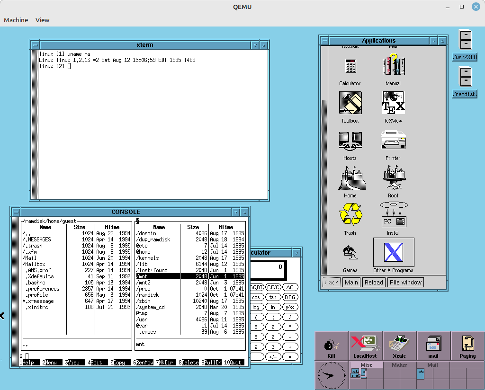
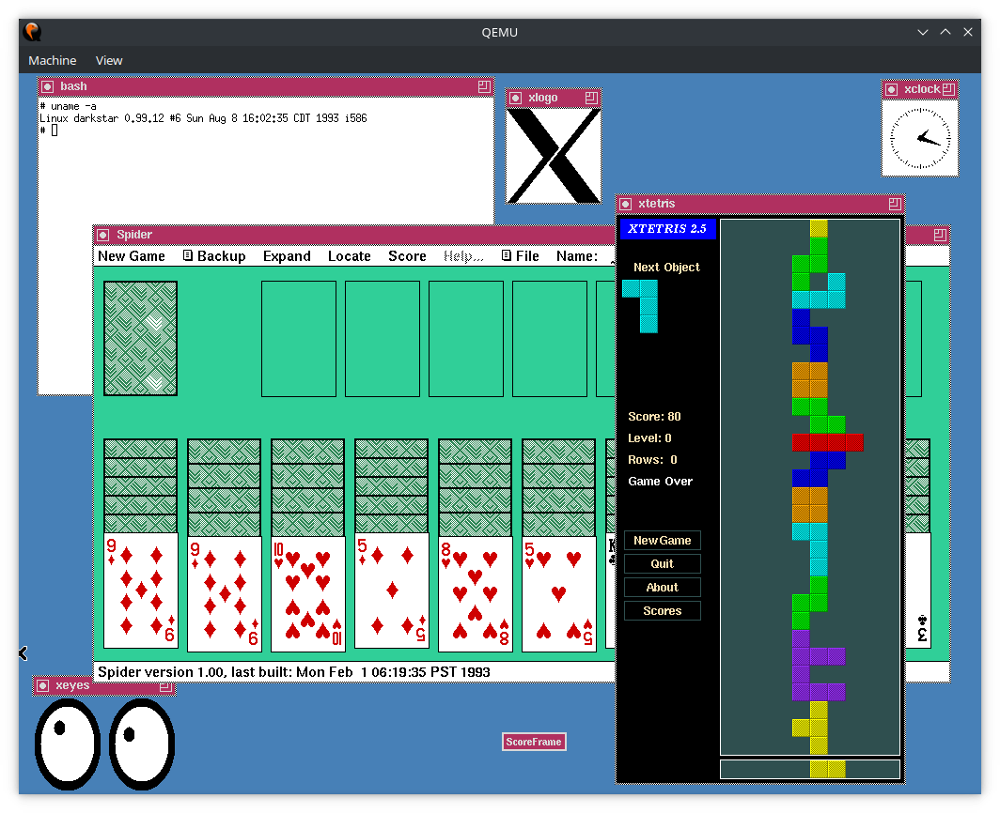
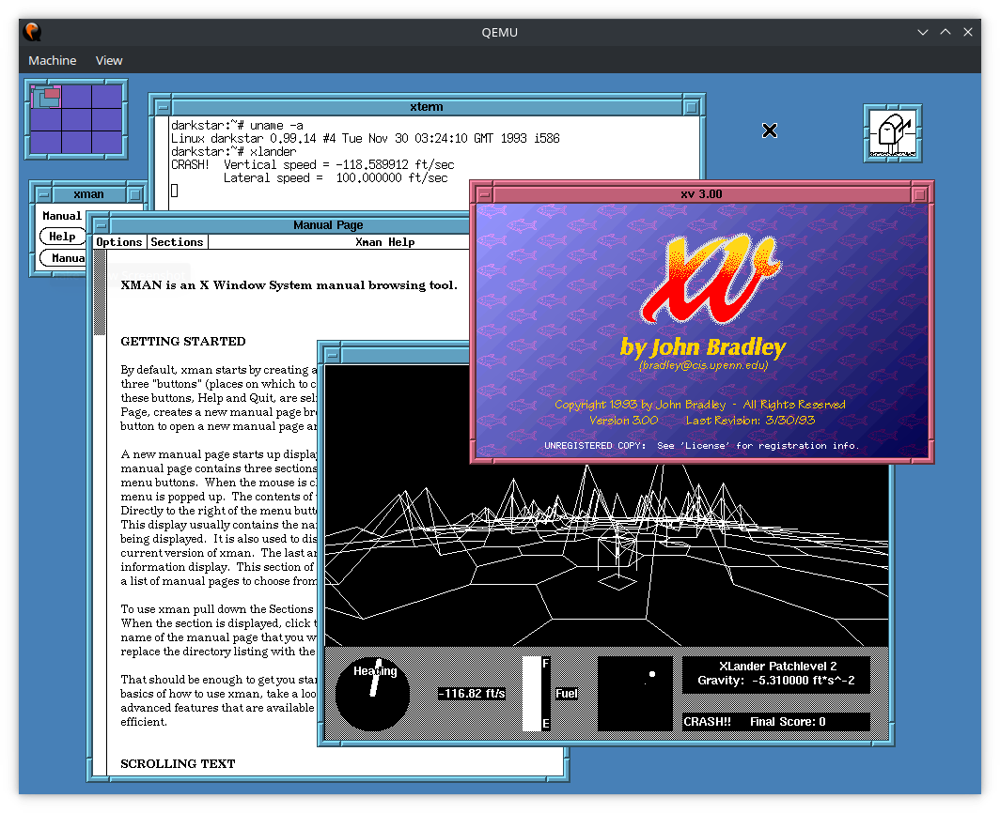

# Retro Distro Playground

This repo contains tools for exploring early Linux distributions in [QEMU](https://www.qemu.org/), a cross-platform emulation and virtualization tool.

Running retro distros in QEMU has been done many times by many people, but until now there has not been a central repository of recipes for running a wide variety of distros.  This project also emphasizes fully automated installs for reproducible build artifacts.





## Prerequisites

The scripts have been developed on Ubuntu 22.04. You will need to install some prerequisites:

```
sudo apt install qemu-system-x86 cloud-image-utils p7zip-full unzip
```

The scripts should theoretically be portable to any other linux Distro that has the prerequisites installed, but I haven't tested this. If you don't use the Jump Box, `cloud-image-utils` are not required.

The `package` command (see below) can be used to package the disk images together with a shells script and batch file to start QEMU. This will allow the image to be run on Windows or other operating systems with only QEMU installed. However, the initial preparation needs to be done on Linux.

## Retro Distros

The `retro` script provides commands for downloading, extracting, and running retro distros. All of the commands take a configuration directory as their first argument. If no directory is provided, the current directory is used.

- `run` will start the distro using the disk images in the `.qemu` directory. Any additional arguments are passed to QEMU verbatim. 
- `extract` will extract the distro into the `.cache` directory.
- `download` will download the distro's original files into the `.downloads` directory.
- `reset` will reset the distro's cache and QEMU configuration
- `patch` will patch the distro's boot/root disk for auto-installation (this requires sudo to mount the image)
- `package` will package the disk images and create shell scripts and batch files to run them in QEMU.

You won't normally need to run `extract` and `download` manually since `run` will automatically run each of them in turn.

The configuration directories are organized into a `distro/version/variant` heirarchy.  In addition to the configuration files, distro directories may contain a README with pertinent information.

Old distros don't support power management, so you should manually run `shutdown -h now` before closing QEMU. To exit QEMU from the command line type `ctrl-a`, then `x` (not `ctrl-x`).

## CD-ROMs

Throughout the 90s, companies sold CD-ROMs with distros on them, usually for less than $50.  Oftentimes these discs also included snapshots of popular Linux FTP sites such as `sunsite.unc.edu` and `tsx-11.mit.edu`. These CD-ROMs were a valuable service in the age of dialup internet, and today they are valuable time capsules that capture the state of the Linux world at the time they were pressed.

Configuration files are provided in the [cdrom](cdrom) directory for downloading and extracting CD ISOs.

## Jump Box

Old distributions are riddled with security holes and have no business being on the internet. If you were to connect them, they often do not support modern network protocols, so you can't do much.  Yes, you *can* put Slackware 1.0 on the internet and `ping www.google.com`, but that's about it, and that's probably a good thing. Even its FTP client won't work from behind a firewall because it doesn't support passive mode.

`jump` will start a modern Ubuntu VM configured as a jump box with an FTP server and other niceties to interact with your retro boxes. This VM has a connection to the internet but also a second private network interface that all the retro boxes can talk to. The VM's SSH port is forwarded to `2222` on the host, and convenience commands are provided to ssh, sftp, and scp. It is accessible to the retro distros via FTP to `10.0.2.1`. The username and password is `retro`/`retro`.  

```
Usage: jump COMMAND ...

Commands:
  run     start the jump box with a serial console
  ssh     ssh into jump box
  sftp    sftp into jump box
  scp     scp file into into jump box

Additional parameters are passed verbatim to ssh/sftp/scp.
For scp, 'retro:*' is expanded to 'retro@localhost:*'.
```

To shut down the jump box, run `sudo poweroff` from the serial console or ssh session.

## Adding Distros

To add support for a new distro, create a new `distro/version/variant` configuration directory.  Configuration files should address the following steps.  Look at the existing distros for examples of how to do this.

### Downloading

Downloads are configured using one of the following files, in order of precedence:

- `download.sh` executes as a general script to handle special cases.
- `urls.txt` contains a list of files to download in the format `filename url` with one file per line.
- `slackver.txt` contains the version to download from the Slackware's [official mirror](https://mirrors.slackware.com/slackware/).

### Extraction

Extraction is configured by files in the distro's config directory:
- `source.txt` specifies the CD-ROM that the distro comes from.
- `extract.sh` performs distro-specific extraction...
  - If the distro doesn't support installing from an IDE CD-ROM, extract package files to the `install` directory. This will be mounted as a FAT partition to `/dev/hdb1`.
  - If a boot floppy is required, copy it to `boot.img`.
  - If a root floppy is required, copy it to `root.img`.
  - Extract any additional files required for installation.

### Preparation

The `retro` script configures QEMU to run the a distro by doing the following:
1. Sets `QEMU_*` variables with the default hardware configuration
   - Creates symlinks to attach installation files to the appropriate device:
   - `boot.img` -> `fda.img`: first floppy drive (`/dev/fd0`)
   - `root.img` -> `fdb.img`: second floppy drive (`/dev/fd1`)
   - `install` -> `hdb`: FAT partition on second IDE drive (`/dev/hdb1`)
   - `disc1.iso` -> `hdc.img`: CD-ROM drive (`/dev/hdc`)
2. Sources the distro's `qemu.sh` file if it exists. This file should:
   - Override `QEMU_*` variables for non-default hardware configuration
   - Create symlinks for any additional files needed by the installation
   - Perform any special-case initialization required by the distro
3. Creates main hard drive image `hda.img` with size `QEMU_HD_SIZE` and format `QEMU_HD_FORMAT`

### Automatic Installation and Configuration

Support may optionally be provided for automatically installing and configuring a distro. Refer to the README in the [autoinst](autoinst) directory for more information.

## Credits

- [QEMU Advent Calendar](https://www.qemu-advent-calendar.org/2014/) for giving me the idea to start playing with this.  Slackware 1.0 is Day 1 from 2014.
- [Archive.org](https://archive.org/) for keeping around all the old CD-ROM and floppy images of distros gone by.
- [Joshua Powers](https://powersj.io/posts/ubuntu-qemu-cli/) for instructions on running an Ubuntu cloud image in QEMU.

## License

Unless otherwise noted, the scripts in this repo are under MIT license.

Copyright 2022 J.B. Langston

Permission is hereby granted, free of charge, to any person obtaining a copy of this software and associated documentation files (the "Software"), to deal in the Software without restriction, including without limitation the rights to use, copy, modify, merge, publish, distribute, sublicense, and/or sell copies of the Software, and to permit persons to whom the Software is furnished to do so, subject to the following conditions:

The above copyright notice and this permission notice shall be included in all copies or substantial portions of the Software.

THE SOFTWARE IS PROVIDED "AS IS", WITHOUT WARRANTY OF ANY KIND, EXPRESS OR IMPLIED, INCLUDING BUT NOT LIMITED TO THE WARRANTIES OF MERCHANTABILITY, FITNESS FOR A PARTICULAR PURPOSE AND NONINFRINGEMENT. IN NO EVENT SHALL THE AUTHORS OR COPYRIGHT HOLDERS BE LIABLE FOR ANY CLAIM, DAMAGES OR OTHER LIABILITY, WHETHER IN AN ACTION OF CONTRACT, TORT OR OTHERWISE, ARISING FROM, OUT OF OR IN CONNECTION WITH THE SOFTWARE OR THE USE OR OTHER DEALINGS IN THE SOFTWARE.