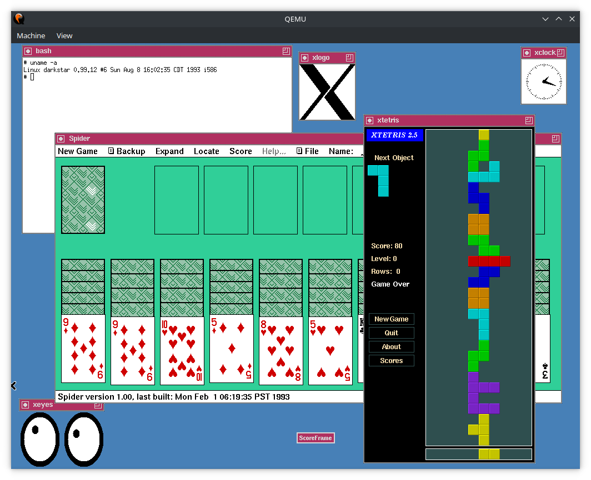
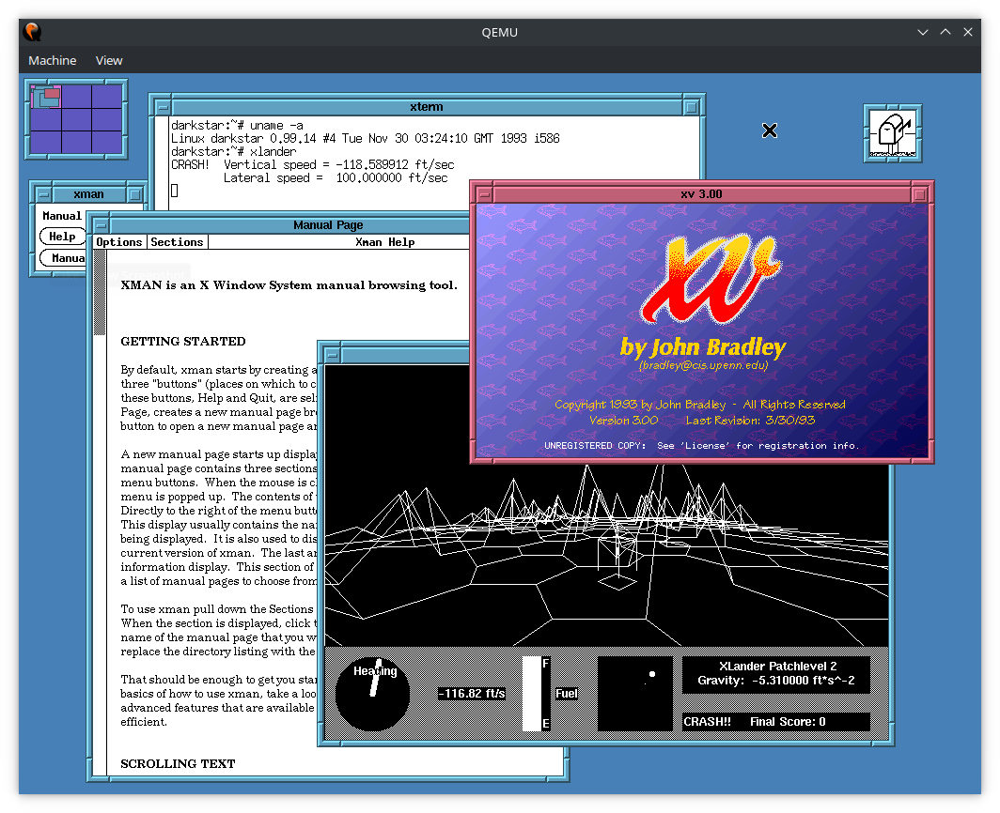

# Retro Distro Playground

Retro Distro Playground downloads, stages, installs, and boots early Linux
distributions in [QEMU](https://www.qemu.org/). It includes recipes for
Slackware, Debian, Red Hat, and historical CD-ROM collections, with many
distros supporting fully scripted unattended installs.




## Quick Start

Install a Unix-like environment first:

- Linux: apt, dnf, and pacman are supported.
- macOS: install [Homebrew](https://brew.sh/).
- Windows: use [MSYS2](https://www.msys2.org/) or WSL2 with a Linux distro.

Clone the repo, then run the bootstrap script. It installs Python, QEMU, and
`mtools`, creates `.venv`, and installs the project into it:

```bash
./retro-prereq
source .venv/bin/activate
```

Running `retro` without a command prints command help.

Boot a distro:

```bash
retro boot slackware/3.0/walnut
```

Run a scripted install when the distro supports it:

```bash
retro install slackware/3.0/walnut
```

`boot` and `install` automatically download and extract the needed media before
starting QEMU.

The host requires Python 3.11 or newer and uses `qemu.qmp` for QMP and
`pycdlib` for ISO access. QEMU and `mtools` are external programs invoked by
the host. Distro behavior is configured in logically sectioned `config.toml`
files; see [CONTRIBUTING.md](CONTRIBUTING.md) for the schema and extension
workflow.

Install the Python development tools and check formatting with:

```bash
python -m pip install -e '.[dev]'
python -m unittest tests.test_python
tests/unit.sh
black --check .
```

The repository is organized around three layers:

- distro configs describe source media, staged files, emulated hardware, and
  optional install and post-install steps;
- `hostlib/` implements downloads, extraction, QEMU lifecycle, and
  host-driven installer automation;
- `guestlib/` is portable code staged into guests for installer adapters and
  final system configuration;

## What You Can Run

Distro configs are organized as `distro/version/variant`. Each config may have a
README with release-specific notes.

- [Slackware](slackware/README.md)
- [Debian](debian/README.md)
- [Red Hat](redhat/README.md)
- [CD-ROM collections](cdrom)

The `cdrom/` directory contains configs for downloading and extracting complete
historical Linux CD-ROM images. In the 1990s these discs often bundled distros
alongside FTP-site snapshots, making them useful time capsules as well as
install media.

## Common Commands

`retro` accepts a command and one optional config directory, which defaults to
the current directory: `retro COMMAND [CONFIG]`.

```bash
retro boot CONFIG       # download, extract, and boot a distro
retro install CONFIG    # boot install media and run scripted install when present
retro extract CONFIG    # stage files into CONFIG/qemu.d/
retro download CONFIG   # download original media only
retro reset CONFIG      # remove generated qemu.d/ and extracted files
retro package CONFIG    # build a portable tar with qemu.d/ and launch scripts
retro tagfile CONFIG    # Slackware only: regenerate default.tag from install media
```

`retro-prereq` is a standalone Bash bootstrap script, not a `retro` command.

Generated VM state lives under each config's `qemu.d/` directory. Downloaded
source media usually lives under `download.d/`; CD-ROM based configs link ISO
files into `qemu.d/`.

The `qmp` utility controls a running VM through its QMP socket. It can inspect
VGA text, send keyboard input, and change removable media; run `qmp --help` for
the complete interface.

Older distros usually do not support power management. Shut guests down from
inside the VM when possible, for example with `shutdown -h now`, then close the
QEMU window or press `Ctrl-C` in the terminal that started `retro`.

Slackware automated installs can choose package series and tagfile behavior in
`[install.slackware]`. See
[Slackware package selection](slackware/README.md#package-selection).

## Networking

By default, VMs use QEMU user-mode networking with outbound internet access and
host port forwards for common guest services:

- SSH: host port range starting at `2200`
- Telnet: host port range starting at `2300`

The exact ports are printed when QEMU starts.

`[qemu.network]` may set `forwards = [[8080, 80],
[2200, 22]]`. An explicit empty array disables forwarding; when the setting is
absent, `retro` uses the default SSH and Telnet ranges above. Set
`enabled = false` in the same table to omit the guest NIC.

**Disclaimer!** Old distros are very insecure, so be careful. QEMU user mode
networking puts the guest interface behind a firewall that blocks incoming
traffic so the risk is mitigated. Just be informed about the risks and avoid
forwarding guest ports to any public interfaces or using guest VMs to send
or store any sensitive information.

## File Transfer

Configs with a `qemu.d/fat/` directory expose it to the guest as a writable FAT
disk, usually mounted from the guest as `/dev/hdb1`. This is the simplest way
to move files between the host and a retro VM. If a config does not already
have `qemu.d/fat/`, create it before booting.

For host-to-guest transfer, copy files into the config's `qemu.d/fat/`
directory, boot the VM, mount the FAT disk inside the guest, then copy the files
to the installed system. For guest-to-host transfer, copy files from the guest
onto the mounted FAT disk, shut down the VM cleanly, then read them from
`qemu.d/fat/` on the host.

Use tar archives when moving Unix files:

```bash
tar -cf qemu.d/fat/files.tar path/to/files
```

Inside the guest, mount the FAT disk and extract the archive onto a Unix
filesystem:

```sh
mount -t msdos /dev/hdb1 /mnt
tar -xf /mnt/files.tar
```

FAT does not preserve Unix permissions, owners, symlinks, or case-sensitive
filename details reliably. A tar archive keeps that metadata intact between the
host filesystem and the guest's Unix filesystem. For best results, avoid
changing `qemu.d/fat/` from the host while the VM is running; copy files in
before boot, and shut the guest down cleanly before reading files back.

## More Documentation

- [CONTRIBUTING.md](CONTRIBUTING.md): adding new distro configs and scripted installs.
- [guestlib/README.md](guestlib/README.md): portable installer adapters and
  post-installation runtime.

## Credits

- [QEMU Advent Calendar](https://www.qemu-advent-calendar.org/2014/) for giving
  me the idea to start playing with this. Slackware 1.0 is Day 1 from 2014.
- [Archive.org](https://archive.org/) for keeping around old CD-ROM and floppy
  images of distros gone by.
- [Joshua Powers](https://powersj.io/posts/ubuntu-qemu-cli/) for instructions
  on running an Ubuntu cloud image in QEMU.

## License

Unless otherwise noted, the scripts in this repo are under MIT license.

Copyright 2022, 2026 J.B. Langston

Permission is hereby granted, free of charge, to any person obtaining a copy of
this software and associated documentation files (the "Software"), to deal in
the Software without restriction, including without limitation the rights to use,
copy, modify, merge, publish, distribute, sublicense, and/or sell copies of the
Software, and to permit persons to whom the Software is furnished to do so,
subject to the following conditions:

The above copyright notice and this permission notice shall be included in all
copies or substantial portions of the Software.

THE SOFTWARE IS PROVIDED "AS IS", WITHOUT WARRANTY OF ANY KIND, EXPRESS OR
IMPLIED, INCLUDING BUT NOT LIMITED TO THE WARRANTIES OF MERCHANTABILITY, FITNESS
FOR A PARTICULAR PURPOSE AND NONINFRINGEMENT. IN NO EVENT SHALL THE AUTHORS OR
COPYRIGHT HOLDERS BE LIABLE FOR ANY CLAIM, DAMAGES OR OTHER LIABILITY, WHETHER
IN AN ACTION OF CONTRACT, TORT OR OTHERWISE, ARISING FROM, OUT OF OR IN
CONNECTION WITH THE SOFTWARE OR THE USE OR OTHER DEALINGS IN THE SOFTWARE.

### License Exceptions

The scripts in the reference directory are a notable exception and retain their
original license. License headers have been kept intact if present. Debian 1.1+
scripts do not contain license headers but are assumed to be GPL.
